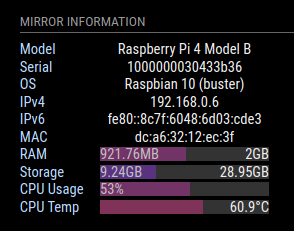

# MMM-Pinfo

A [MagicMirror²](https://magicmirror.builders/) module that can display device information. This module is mainly inspired by [MMM-Tools](https://github.com/bugsounet/MMM-Tools). To develop this module I used Node.js. Also, MagicMirror users can set warnings for abnormal information. MagicMirror will send a notification if any information exceeds the standard value.

## Screenshot



## Dependencies

- [systeminformation](https://www.npmjs.com/package/systeminformation)

## Installation

Get the module directly from GitHub and install to MagicMirror using the following commands.

```sh
cd ~/MagicMirror/modules/
git clone https://github.com/SalekurPolas/MMM-Pinfo
cd MMM-Pinfo
npm install
```

### Manual Installation

Although dependencies will automatically install during installation on MagicMirror, you can manually install them by the following steps.

1. systeminformation

```sh
cd ~/MagicMirror/MMM-Pinfo
npm install systeminformation
```

## Updating

```sh
cd ~/MagicMirror/modules/MMM-Pinfo
git pull
npm install
```

## Usage

`MMM-Pinfo` module can display the following information

| Name            | Description
| --------------- | --------
| Model           | Display model name and number of the device
| Serial          | Display the unique serial number of the device
| Network type    | Display connected network types like WLAN, LAN, etc
| IPv4            | Display IPv4 of the corresponding network
| IPv6            | Display IPv6 of the corresponding network
| MAC             | Display MAC address of the corresponding network
| RAM             | Display total size, usage, and percentage usage of the RAM
| Storage         | Display total size, usage, and percentage usage of the Storage
| CPU type        | Display CPU type of the device
| CPU usage       | Display the percentage of usage
| CPU temp        | Display current temperature of the CPU
| System uptime   | Display the uptime of the system

### Module Usage

To setup `MMM-Pinfo` module in MagicMirror², add the following section to the `config.js` file in the `MagicMirror/config` directory.

```js
    {
      module: 'MMM-Pinfo',
      position: 'top_left'
    },
```

## Configuration

<table>
    <thead>
      <tr>
        <td><b>Option</b></td>
        <td align=center><b>Type</b></td>
        <td align=center><b>Default</b></td>
        <td><b>Description</b></td>
      </tr>
    </thead>
    <tbody>
      <tr>
        <td><code>debug</code></td>
        <td align=center><code>boolean</code></td>
        <td align=center><code>true</code></td>
        <td>Enable printing debug information</td>
      </tr>
      <tr>
        <td><code>refresh</code></td>
        <td align=center><code>number</code></td>
        <td align=center><code>5000</code></td>
        <td>Time in milliseconds to refresh automatically</td>
      </tr>
      <tr>
        <td><code>itemAlign</code></td>
        <td align=center><code>string</code></td>
        <td align=center><code>'left'</code></td>
        <td>MMM-Pinfo items alignment.</td>
      </tr>
      <tr>
        <td><code>labelAlign</code></td>
        <td align=center><code>string</code></td>
        <td align=center><code>'left'</code></td>
        <td>Item's label alignment.</td>
      </tr>
      <tr>
        <td><code>valueAlign</code></td>
        <td align=center><code>string</code></td>
        <td align=center><code>'center'</code></td>
        <td>Item's value alignment.</td>
      </tr>
      <tr>
        <td><code>labelSize</code></td>
        <td align=center><code>number</code></td>
        <td align=center><code>null</code></td>
        <td>Size of the item's label in px</td>
      </tr>
      <tr>
        <td><code>containerSize</code></td>
        <td align=center><code>number</code></td>
        <td align=center><code>null</code></td>
        <td>Size of the item's value container in px</td>
      </tr>
      <tr>
        <td><code>DEVICE.labelModel</code></td>
        <td align=center><code>string</code></td>
        <td align=center><code>'Model'</code></td>
        <td>Label of the model</td>
      </tr>
      <tr>
        <td><code>DEVICE.displayModel</code></td>
        <td align=center><code>boolean</code></td>
        <td align=center><code>true</code></td>
        <td>Display model</td>
      </tr>
      <tr>
        <td><code>DEVICE.orderModel</code></td>
        <td align=center><code>number</code></td>
        <td align=center><code>1</code></td>
        <td>Order of model</td>
      </tr>
      <tr>
        <td><code>DEVICE.labelSerial</code></td>
        <td align=center><code>string</code></td>
        <td align=center><code>'Serial'</code></td>
        <td>Label of serial</td>
      </tr>
      <tr>
        <td><code>DEVICE.displaySerial</code></td>
        <td align=center><code>boolean</code></td>
        <td align=center><code>true</code></td>
        <td>Display serial</td>
      </tr>
      <tr>
        <td><code>DEVICE.orderSerial</code></td>
        <td align=center><code>number</code></td>
        <td align=center><code>2</code></td>
        <td>Order of serial</td>
      </tr>
      <tr>
        <td><code>OS.labelOs</code></td>
        <td align=center><code>string</code></td>
        <td align=center><code>'OS'</code></td>
        <td>Label of OS</td>
      </tr>
      <tr>
        <td><code>OS.displayOs</code></td>
        <td align=center><code>boolean</code></td>
        <td align=center><code>false</code></td>
        <td>Display OS</td>
      </tr>
      <tr>
        <td><code>OS.orderOs</code></td>
        <td align=center><code>number</code></td>
        <td align=center><code>3</code></td>
        <td>Order of OS</td>
      </tr>
      <tr>
        <td><code>NETWORK.labelType</code></td>
        <td align=center><code>string</code></td>
        <td align=center><code>'NET Type'</code></td>
        <td>Label of NET Type</td>
      </tr>
      <tr>
        <td><code>NETWORK.displayType</code></td>
        <td align=center><code>boolean</code></td>
        <td align=center><code>false</code></td>
        <td>Display NET Type</td>
      </tr>
      <tr>
        <td><code>NETWORK.orderType</code></td>
        <td align=center><code>number</code></td>
        <td align=center><code>4</code></td>
        <td>Order of NET Type</td>
      </tr>
      <tr>
        <td><code>NETWORK.labelIPv4</code></td>
        <td align=center><code>string</code></td>
        <td align=center><code>'IPv4'</code></td>
        <td>Label of IPv4</td>
      </tr>
      <tr>
        <td><code>NETWORK.displayIPv4</code></td>
        <td align=center><code>boolean</code></td>
        <td align=center><code>true</code></td>
        <td>Display IPv4</td>
      </tr>
      <tr>
        <td><code>NETWORK.orderIPv4</code></td>
        <td align=center><code>number</code></td>
        <td align=center><code>5</code></td>
        <td>Order of IPv4</td>
      </tr>
      <tr>
        <td><code>NETWORK.labelIPv6</code></td>
        <td align=center><code>string</code></td>
        <td align=center><code>'IPv6'</code></td>
        <td>Label of IPv6</td>
      </tr>
      <tr>
        <td><code>NETWORK.displayIPv6</code></td>
        <td align=center><code>boolean</code></td>
        <td align=center><code>false</code></td>
        <td>Display IPv6</td>
      </tr>
      <tr>
        <td><code>NETWORK.orderIPv6</code></td>
        <td align=center><code>number</code></td>
        <td align=center><code>6</code></td>
        <td>Order of IPv6</td>
      </tr>
      <tr>
        <td><code>NETWORK.labelMac</code></td>
        <td align=center><code>string</code></td>
        <td align=center><code>'MAC'</code></td>
        <td>Label of MAC</td>
      </tr>
      <tr>
        <td><code>NETWORK.displayMac</code></td>
        <td align=center><code>boolean</code></td>
        <td align=center><code>false</code></td>
        <td>Display MAC</td>
      </tr>
      <tr>
        <td><code>NETWORK.orderMac</code></td>
        <td align=center><code>number</code></td>
        <td align=center><code>7</code></td>
        <td>Order of MAC</td>
      </tr>
      <tr>
        <td><code>RAM.labelRam</code></td>
        <td align=center><code>string</code></td>
        <td align=center><code>'RAM'</code></td>
        <td>Label of RAM</td>
      </tr>
      <tr>
        <td><code>RAM.displayRam</code></td>
        <td align=center><code>boolean</code></td>
        <td align=center><code>true</code></td>
        <td>Display RAM</td>
      </tr>
      <tr>
        <td><code>RAM.orderRam</code></td>
        <td align=center><code>number</code></td>
        <td align=center><code>8</code></td>
        <td>Order of RAM</td>
      </tr>
      <tr>
        <td><code>STORAGE.labelStorage</code></td>
        <td align=center><code>string</code></td>
        <td align=center><code>'Storage'</code></td>
        <td>Label of Storage</td>
      </tr>
      <tr>
        <td><code>STORAGE.displayStorage</code></td>
        <td align=center><code>boolean</code></td>
        <td align=center><code>true</code></td>
        <td>Display Storage</td>
      </tr>
      <tr>
        <td><code>STORAGE.orderStorage</code></td>
        <td align=center><code>number</code></td>
        <td align=center><code>9</code></td>
        <td>Order of Storage</td>
      </tr>
      <tr>
        <td><code>CPU.labelType</code></td>
        <td align=center><code>string</code></td>
        <td align=center><code>'CPU Type'</code></td>
        <td>Label of CPU Type</td>
      </tr>
      <tr>
        <td><code>CPU.displayType</code></td>
        <td align=center><code>boolean</code></td>
        <td align=center><code>false</code></td>
        <td>Display CPU Type</td>
      </tr>
      <tr>
        <td><code>CPU.orderType</code></td>
        <td align=center><code>number</code></td>
        <td align=center><code>10</code></td>
        <td>Order of CPU Type</td>
      </tr>
      <tr>
        <td><code>CPU.labelUsage</code></td>
        <td align=center><code>string</code></td>
        <td align=center><code>'CPU Usage'</code></td>
        <td>Label of CPU Usage</td>
      </tr>
      <tr>
        <td><code>CPU.displayUsage</code></td>
        <td align=center><code>boolean</code></td>
        <td align=center><code>false</code></td>
        <td>Display CPU Usage</td>
      </tr>
      <tr>
        <td><code>CPU.orderUsage</code></td>
        <td align=center><code>number</code></td>
        <td align=center><code>11</code></td>
        <td>Order of CPU Usage</td>
      </tr>
      <tr>
        <td><code>CPU.labelTemp</code></td>
        <td align=center><code>string</code></td>
        <td align=center><code>'CPU Temp'</code></td>
        <td>Label of CPU Temp</td>
      </tr>
      <tr>
        <td><code>CPU.displayTemp</code></td>
        <td align=center><code>boolean</code></td>
        <td align=center><code>true</code></td>
        <td>Display CPU Temp</td>
      </tr>
      <tr>
        <td><code>CPU.orderTemp</code></td>
        <td align=center><code>number</code></td>
        <td align=center><code>12</code></td>
        <td>Order of CPU Temp</td>
      </tr>
      <td><code>UPTIME.labelUptime</code></td>
        <td align=center><code>string</code></td>
        <td align=center><code>'Uptime'</code></td>
        <td>Label of Uptime</td>
      </tr>
      <tr>
        <td><code>UPTIME.displayUptime</code></td>
        <td align=center><code>boolean</code></td>
        <td align=center><code>false</code></td>
        <td>Display Uptime</td>
      </tr>
      <tr>
        <td><code>UPTIME.orderUptime</code></td>
        <td align=center><code>number</code></td>
        <td align=center><code>13</code></td>
        <td>Order of Uptime</td>
      </tr>
      <tr>
        <td><code>WARNING.enable</code></td>
        <td align=center><code>boolean</code></td>
        <td align=center><code>false</code></td>
        <td>Display warning for unusual value</td>
      </tr>
      <tr>
        <td><code>WARNING.interval</code></td>
        <td align=center><code>number</code></td>
        <td align=center><code>5000</code></td>
        <td>Time in milliseconds to refresh warning</td>
      </tr>
      <tr>
        <td><code>WARNING.check.CPU_TEMP</code></td>
        <td align=center><code>number</code></td>
        <td align=center><code>65</code></td>
        <td>Normal temperature for CPU Temp</td>
      </tr>
      <tr>
        <td><code>WARNING.check.CPU_USAGE</code></td>
        <td align=center><code>number</code></td>
        <td align=center><code>75</code></td>
        <td>Normal usage for CPU</td>
      </tr>
      <tr>
        <td><code>WARNING.check.RAM_USED</code></td>
        <td align=center><code>number</code></td>
        <td align=center><code>80</code></td>
        <td>Normal usage for RAM</td>
      </tr>
      <tr>
        <td><code>WARNING.check.STORAGE_USED</code></td>
        <td align=center><code>number</code></td>
        <td align=center><code>80</code></td>
        <td>Normal usage for STORAGE</td>
      </tr>
    </tbody>
  </table>

## Default Configuration

```js
  {
    module: 'MMM-Pinfo',
    position: 'top_left',
    config: {
      debug: true,
      refresh: 5000,
      itemAlign: 'left',
      labelAlign: 'left',
      valueAlign: 'center',
      labelSize: null,
      containerSize: null,

      DEVICE: {
        labelModel: "Model",
        displayModel: true,
        orderModel: 1,

        labelSerial: 'Serial',
        displaySerial: true,
        orderSerial: 2
      },

      OS: {
        labelOs: 'OS',
        displayOs: false,
        orderOs: 3
      },

      NETWORK: {
        labelType: 'NET Type',
        displayType: false,
        orderType: 4,

        labelIPv4: 'IPv4',
        displayIPv4: true,
        orderIPv4: 5,

        labelIPv6: 'IPv6',
        displayIPv6: false,
        orderIPv6: 6,

        labelMac: 'MAC',
        displayMac: false,
        orderMac: 7
      },

      RAM: {
        labelRam: 'RAM',
        displayRam: true,
        orderRam: 8
      },

      STORAGE: {
        labelStorage: 'Storage',
        displayStorage: true,
        orderStorage: 9,
      },

      CPU: {
        labelType: 'CPU Type',
        displayType: false,
        orderType: 10,

        labelUsage: 'CPU Usage',
        displayUsage: false,
        orderUsage: 11,

        labelTemp: 'CPU Temp',
        displayTemp: true,
        orderTemp: 12
      },
      UPTIME: {
          labelUptime: 'Uptime',
          displayUptime: false,
          orderUptime: 13
        },
      WARNING: {
        enable: false,
        interval: 1000 * 60 * 5,
        check: {
          CPU_TEMP: 65,
          CPU_USAGE: 75,
          RAM_USED: 80,
          STORAGE_USED: 80
        }
      },
    }
  },
```

## Issues

- Support for multiple language is not yet complete.
- If if have any other issues then let me know at [Issues](https://github.com/SalekurPolas/MMM-Pinfo/issues).

## Credits

- Michael Teeuw for the awesome invention [MagicMirror²](https://github.com/MagicMirrorOrg/MagicMirror).
- Bugsounet Cédricfor the original module [MMM-Tools](https://github.com/bugsounet/MMM-Tools).
